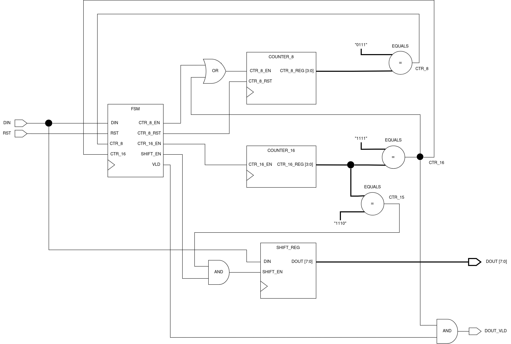
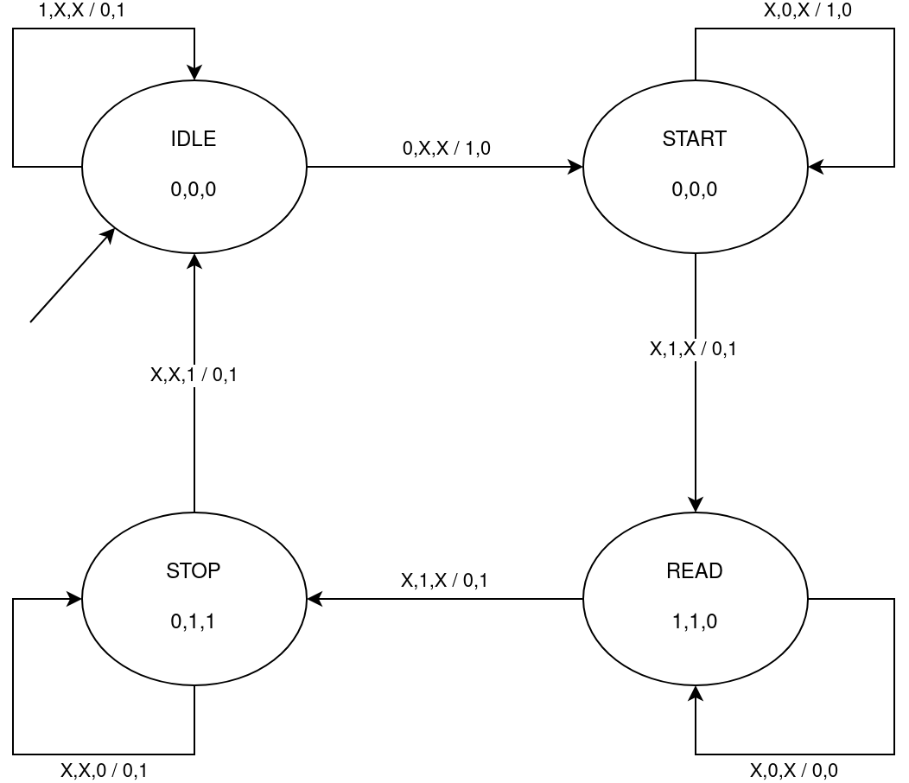
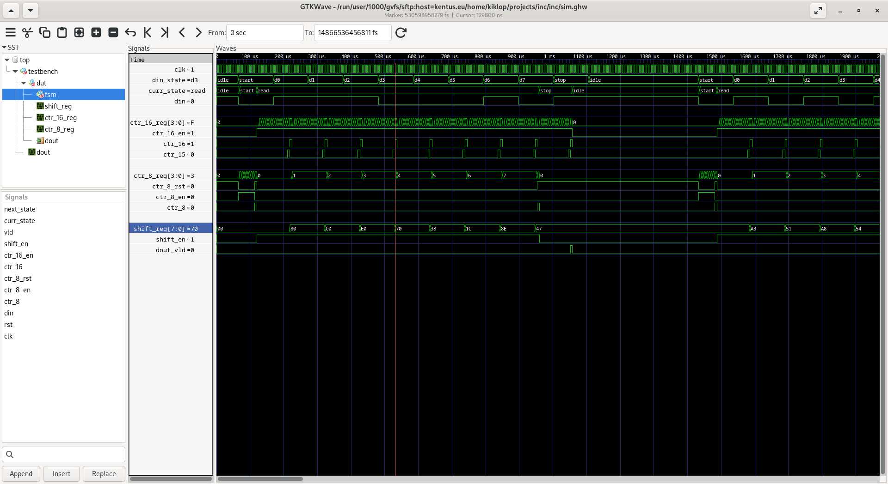

# Výstupní zpráva

Jméno: Tomáš Brablec

Login: xbrabl04

## Architektura navrženého obvodu

### Schéma obvodu

### Popis funkce

Stavový automat je inicializován do stavu IDLE, ve kterém čeká, dokud není na `DIN`
logická nula. Poté přechází do stavu START, a spustí `COUNTER_8` nastavením logické
jedničky na výstupu `CTR_8_EN`. Jakmile dosáhne hodnota v čítači osmi (resp. sedmi, protože
počítá od nuly), signál `CTR_8` jde do log. 1, a automat přejde do stavu READ. Už při přechodu
resetuje čítač `COUNTER_8`, který bude dále využit k počítání přijatých datových bitů. Při
změně stavu je rovněž spuštěn čítač `COUNTER_16`, který bude určovat mezery mezi jednotlivými
datovými bity, přičemž signál `CTR_15` slouží k zapsání bitu z `DIN` do posuvného registru
`SHIFT_REG`, a signál `CTR_16` inkrementuje počet přijatých bitů. Jakmile je přijato
všech 8 datových bitů, signál `CTR_8` přechází opět do log. 1, a posune FSM do stavu STOP. 
Čítač `COUNTER_16` napočítá dalších 16 hodinových cyklů, tím se dostane do STOP bitu, načež
se na jeden hodinový cyklus aktivuje výstup `DOUT_VLD`, a automat přechází zpět do stavu IDLE.

## Návrh stavového automatu

### Schéma automatu

Legenda:

- Stavy automatu: IDLE, START, READ, STOP
- Vstupní signály: DIN, CTR\_8, CTR\_16
- Mealyho výstupy: CTR\_8\_EN, CTR\_8\_RST
- Moorovy výstupy: SHIFT\_EN, CTR\_16\_EN, VLD

### Popis funkce

Automat se po resetování nachází ve stavu IDLE, ve kterém čeká na log. nulu v `DIN`. Poté
přechází do stavu START, ve kterém čeká 8 hodinových cyklů. Po osmi cyklech se DIN nachází
přesně ve středu START bitu. FSM následně přechází do stavu READ, kdy spustí opakující se
čítač, který každých 16 hodinových cyklů načte jeden bit z `DIN` do posuvného registru.
Vzhledem k tomu, že byl 16 stavový čítač spuštěn uprosteřed START bitu, bude hodnota z `DIN`
samplována přesně ve středu každého datového bitu. Po zaznamenání všech osmi bitů přechází
automat do stavu STOP, ve kterém čeká dalších 16 cyklů. Po šestnácti cyklech se nachází DIN
uvnitř STOP bitu (log. 1), takže může automat přejít zpět do stavu IDLE. Ve stavu STOP je
aktivní výstup `VLD`, který po operaci AND s výstupem 16 stavového čítače na jeden hodinový cyklus 
aktivuje výstup `DOUT_VLD`.

## Snímek obrazovky ze simulací

