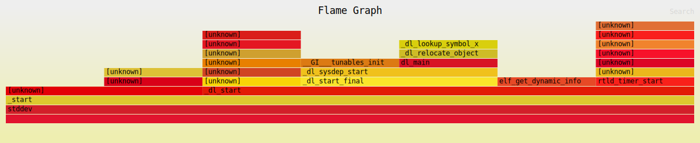
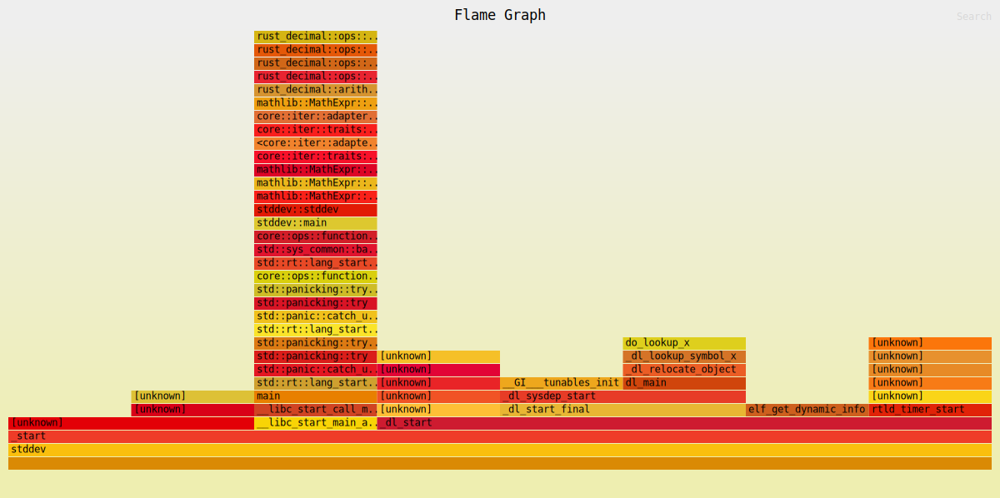
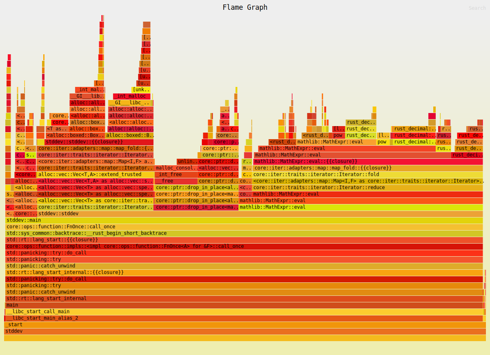

# Profiling

## Vyhodnocení

Jak můžete vidět z níže uvedených grafů, při profilování s nižšími počty samplů (deset
a tisíc) se z důvodu nízkého množství naměřených dat vliv matematické knihovny ani neprojeví.
Až u milionu samplů můžeme vidět, že samotné volání metody `eval` na `MathExpr` zabírá jen
přibližně polovinu času. Pokud si tuto část rozklikneme (viz poznámka), uvidíme že zde 
strávený čas je víceméně rovnoměrně rozdělen mezi jednotlivé metody knihovny `rust_decimal`,
což znamená že overhead naší knihovny je zanedbatelný. Co se týče samotného programu
stddev, můžeme si všimnout že dost času tráví v metodě `powd`, která je použitá pro implementaci
druhé mocniny. Toto nejspíš nebylo nutné, stačilo výrazy vynásobit, to by pravděpodobně bylo
rychlejší. Mimo volání `eval`, čtvrtinu času zabere jen konstrukce výrazu (metoda 
`collect`). Toto je limitace našeho designu knihovny, a toho že je určená pro 
vyhodnocování výrazů místo "jen" počítání. Zbytek času je pak rozdělen mezi I/O operace a 
parsování textových floatů na `Decimal` hodnoty.

*Pozn.: grafy si můžete otevřít v interaktivní podobě ve webovém prohlížeči, otevřením 
souboru `flamegraph_XX.svg`*

## Deset samplů

## Tisíc samplů

## Milion samplů

