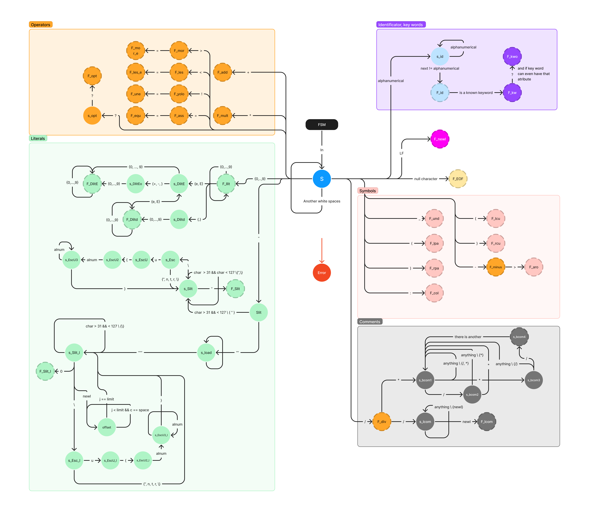
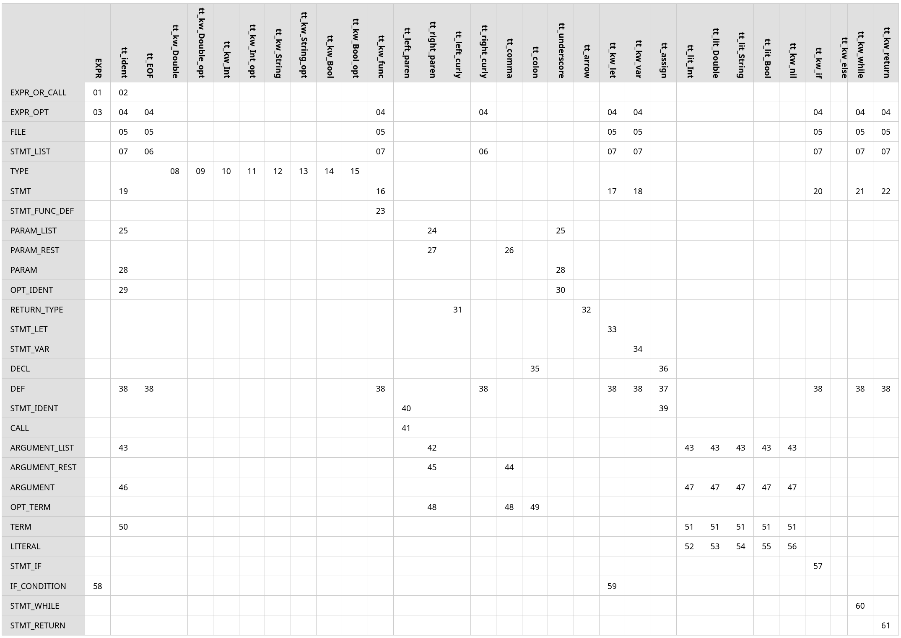

<style>
// gtfo pedants
* {
    text-align: justify;
    color: black;
}
</style>

# IFJ project documentation

## Project authors

- Anna Králová (xkralo07) (team leader)
- Abas Hashmy (xhashm00)
- Jaroslav Vehovský (xvehov01)
- Tomáš Brablec (xbrabl04)

## Distribution of points

- xkralo07 - 25%
- xvehov01 - 25%
- xhashm00 - 25%
- xbrabl04 - 25%

## Assignment variant

__Tým xkralo07, varianta TRP-izp__

## Division of work

- xkralo07 - recursive descent parser
- xhashm00 - tokenizer
- xvehov01 - precedence parser
- xbrabl04 - semantic analyzer, codegen

## Implemented extensions

__BOOLTHEN__

# Overall architecture of the compiler

Since we basically had two weeks to do the entire project, we chose a simple design,
always preferring code simplicity and robustness over efficiency or extensibility.

The tokenizer (`tokenizer.h`) exposes a single function for loading the next token, which is not used directly
by parsers, but by a token table, which is filled once before parsing, and then stays
on the heap until the end of compilation. Pointers to tokens in this table can therefore
be used throughout the program without fear of accessing freed memory.

The compiler doesn't use an AST to represent code internally, instead the output code
is generated on-the-fly during a single (main) pass over the input code. We chose
a syntax-directed compilation approach - the recursive descent parser (`rec_parser.h`) (from now on,
the *main parser*) makes calls to the semantic analyzer/codegen. AST is not built even for
expressions, which are also checked/generated as the precedence parser (`parser.h`) progresses.

The semantic analyzer (`sem_stmt.h`, `sem_expr.h`) and codegen are mostly implemented together,
in the same functions.
Splitting these into two separate modules wouldn't have a big benefit in clarity, since
much code would be either duplicated or shared in a third, common module, further complicating
things.

*Note: in the following chapters, a corresponding module is always mentioned. Modules are pairs of
`.c` and `.h` files, together forming a compilation unit. For simplicity, only the `.h` file
containing the public interface of each module is mentioned.*

# Structure of a token

*Module: `global_include.h`*

A single token is composed of the following data:

- an enum representing the token's type, this is used by parsers to differentiate tokens
- a union with the token's content (only identifiers and literals have a content, the other
  tokens are fully described by their token type
- the token's line number, length, and pointer into the line in the source code buffer, that
  contains the start of the token (these are used for user-friendly error printing)

Since no error printing is a part of the requirements, one might ask why we included such
an elaborate system for pretty-printing errors. This was done for two reasons: firstly, it
allowed for very concise error handling. The only thing required to print an error and cleanly
exit a program with the correct exit code was to call a single function, `print_error_exit`,
and pass it the token itself, error type, and an error message, and the function would handle
the rest. The other reason was a huge speedup in debugging, since the error function printed
the whole line containing the error, underlined the token related to the error, and printed the
reason why the compilation failed, instead of just returning the error code itself. This
proved very useful in debugging both parsers, semantic analysis and codegen.

# Tokenizer

*Module: tokenizer.h*

Tokenizer is implemented through a finite state machine with some deviations from the original
scheme. Diagram of the state machine is available below in Attachments.

The finite state machine is divided into multiple sections in code. The main function for the tokenizer
is called `get_token()` and each function call from it roughly represents one section of the state
machine (literals, symbols, operators, identifiers and keywords, comments, newline and end-of-file).

Rather than the entire tokenizer being a single big state machine,
the sections themselves contain smaller, more manageable FSMs.
Identificators and keywords are in the same section because they are evaluated in the same way, with
the final identificator being checked for being a keyword.

Some operators, like `/`, are evaluated in other sections because they share characters with unrelated
lexemes (comments).

Multiline string literal is not processed in a single step, but at first, the whole string
is loaded into a temporary buffer, where the mandatory offset after a new line
is calculated according to the ending triple-quotes. Then the ending of the string is stripped by
setting the first byte to discard to value 0. Lastly, the string content is copied into the final
buffer, while discarding the spaces in offset, and substituting escape characters.

Anything unexpected is treated as an error and terminates the compiler.

# Token table

*Module: `token_table.h`*

Token table is used for storing and accessing tokens.
It first loads all tokens by calling the tokenizer, until it receives an end-of-file token.
The token table discards all newline tokens, and stores information about preceding newline into the next
non-newline token. This is done to simplify grammar and main parser.

After storing all the tokens in an array, it sets an internal pointer to the first
token and allows operations `peek`, `next` and `previous`, through its public API.
These are used by the parsers.

# Recursive descent parser

*Module: rec_parser.h*

The parser is written according to the LL1 grammar (available below), with some exceptions.
Each nonterminal is represented by a function with the same name, prefixed by `parse_`. We use
some helper macros, such as `expect_token`, which fetches the current token, and checks if its
type agrees with the expected type. If not, extra information about the error is printed for
debugging purposes, and parsing fails with an error.

The parser makes calls to the semantic analyzer, giving it the parsed tokens, and occasionally
carrying some context information further (for example, when parsing a function call, the semantic
analyzer gives the parser some info about the called function, which the parser carries to the
other calls to semantic analyzer, that handle function arguments).

## Return analysis

The parser also does the "return analysis", which determines, whether a return statement
is present in every possible path of the program inside a function. Result of the analysis is a single
boolean value. The analysis runs for each statement, according to the following rules:

- sequence of statements yields `true` if at least one of the statements inside yields `true`
- if statement yields `true`, if both of its branches yield `true`
- return statement yields `true`
- any other statement yields `false`

Result of this analysis is then passed to the semantic analyzer, which decides whether the function
was supposed to return a value, and checks whether this was actually satisfied.

## Handling newlines

Even though a token type for newline exists, it is not used in grammar, nor in any of the parsers.
It is emitted by the tokenizer, but discarded in code that fills the token table, and the information
about a newline is inserted directly into the first non-newline token following the newline.

This information is then used to check if the first token of a statement was preceded by a newline.
The first token is not checked, and therefore it is possible to write a whole code block with
just one statement on a single line:

```swift
if true { write("then") } else { write("else") }
```

## Exceptions to LL1 grammar

When interfacing with the precedence parser, in rules for `EXPR_OR_CALL` and `EXPR_OPT`, we must
look two tokens ahead, and determine the correct rule to follow. The problem arises in the following
situations:

```swift
return
a = 5

return
a()
```

In these cases, we need to parse nonterminal `EXPR_OPT` after finding `return`, but we cannot just
look at the following token and run the precedence parser if it belongs to First(EXPR), because in these
cases, the next token is `tt_ident`, which the precedence parser would parse successfully,
and consume the token. After that, we would attempt to parse the rest (`= 5` or `()`), which
would result in an error. This is solved by looking two tokens ahead, and if they match
(`tt_ident`, `tt_assign`), or (`tt_ident`, `tt_left_paren`), we go according to the epsilon rule
and don't parse an expression (which corresponds to the return statement without any expression).

In the following case, a similar problem occurs:

```swift
let a = b()
// vs
let a = b + c
```

after parsing `=`, we need to parse either expression, or call (nonterminal `EXPR_OR_CALL`).
Here, we also need to look at first two tokens, and if they match (`tt_ident`, `tt_left_paren`),
we parse this as a function call, otherwise, the precedence parser is ran.

# Precedence parser

*Module: parser.h*

The precedence parser analyzes and ensures the correct order of execution of operations in
expressions. It iteratively consumes tokens until the end of the expression is found.
Subsequently, the parser checks the precedence of the incoming token and the non-expression
token at the top of the stack using the precedence table. Based on the precedence
of the incoming token, the parser decides whether to shift or reduce the token onto the stack,
terminate the expression or return an error.

## Reducing

Expression reduction follows these four rules:

1. `E -> i`
1. `E -> E!`
1. `E -> E <infix operator> E`
1. `E -> (E)`

The first rule is implemented by calling the semantic analysis function for
a term and pushing the resulting expression back onto the stack.
The second and third rules are similarly implemented through semantic analysis based on
the operator and the resulting expression is then pushed back onto the stack.
The fourth rule is addressed by removing parentheses and returning the original
expression to the stack. If none of these rules are met, the parser returns an error.

# Symbol names in IFJcode23

Because IFJ23 supports variable shadowing, multiple scopes need to be accessible
at the same time in IFJcode23. Therefore, when one variable in IFJ23 shadows another,
both need to exist alongside each other in IFJcode23. For this, we need to extend
variable names in IFJcode23 beyond the original IFJ23 name.

In our compiler, variable names in IFJcode23 all have the postfix `$id`, where `id` is a
program-wide unique number. For each variable, this will be generated and stored in
symbol table. Numbers will be assigned sequentially, starting from zero. This means
there will be an implementation limit on the number of variables in a program.

## Exceptions

One exception to this rule are function parameters of built-in functions, since those
are coded directly in IFJcode23, and therefore their arguments and internal variables
cannot have IDs generated at compile time. This is solved by a condition in codegen,
which omits IDs for built-in function parameters.

# Symbol table

*Modules: symtable.h (hashmap), sem_state.h (the rest)*

Symbol table is implemented in two parts, hashmap in one module, and the rest of the table
in another. The whole table consists of two stacks of hashmaps, representing the scopes
in local and global frame. From here on, a *scope* will refer to any block of code that
allows for shadowing of variables from the scope above. The symbol table module also
implements an algorithm for symbol lookup, which finds the stored information about
a variable with given name. The algorithm walks the current stack of scopes from the bottom up,
querying each hashmap, and returning the first found result.

The data stored about each variable is the usual: whether it is initialized, whether it
is mutable, the type of the variable, and also a unique ID of that variable (explained below).

# Calling convention of IFJcode23

## Non-variadic functions

Function labels are identical to their names, since function names are unique in IFJ23.
A function call consists of the following steps:

- create new a temporary frame
- create variables inside TF named after identifiers (not names) of input parameters
  of called function
- call with a label identical to the function name

If a function is not void, then also:

- push special variable `$return` from TF onto the stack
- return value is available on top of the stack (as if an expression was evaluated)

Bodies of all functions are located after the end of the main program. Function code
consists of the following:

- label instruction with a name identical to the function name
- pushframe instruction to move TF into new LF
- function code that uses input parameters as top-scope immutable local variables
- move returned value into a special local variable `$return`
- popframe instruction to remove the local frame into a temporary frame
- return instruction

## Variadic functions (only `write` function)

Since IFJ23 doesn't allow user-created variadic functions, and the only predefined
variadic function is `write`, variadic functions will not have a standalone calling
convention. Instead, uses of `write` will be directly inserted (inlined) into
calling code.

# Function table

*Module: function_table.h*

Function table is represented simply by a vector of structs containing information about
each function, and it is used by semantic analysis and codegen.

## Finding function signatures

*Module: sem_find_functions.h*

Since IFJ23 supports calling functions above their definition, it is necessary to
find all functions and add them to the function table before starting the main compiler pass.
The other option (without building an AST) would be to log function calls and definitions
into a separate table during the main (and only) pass, and check that the call signatures
conform to the function definitions after finishing the pass. This would complicate the
calling convention, since arguments couldn't be simply created inside TF and then moved
into function's LF, because the parameter identifiers wouldn't have been known yet.
That's why we chose to do a simple pass before the main pass, which simply finds each
`func` keyword token in the token table, and runs a function for parsing function definition
in special mode, which parses just the header, not the body. During the main pass, the function
header is just parsed, without adding the function to the function table again.

## Built-in functions

*File: builtin_functions.c*

Built-in functions are implemented directly in assembly, and inserted into the generated code
at the end. The functions internally use variables prefixed with `$` not to collide with any
other names. These functions are registered into the function table before the main pass starts,
so that the usual code for semantic analysis and codegen of function calls can be used.

# Semantic analysis

*Modules: sem_stmt.h (statements), sem_expr.h (expressions)*

Semantic analysis is implemented without any special structure. There are simply two modules,
one for expressions, and another for statements, which both expose many functions, each
to be called when any specific statement/expression is parsed. Input parameters specify
the tokens which are to be passed into semantic analysis. Sometimes, information about a
parsed structure (such as info about called function) must be propagated from a result
of one function into the argument of another. The semantic analyzer checks for type compatibility
of assignments, definitions with explicit type, conditions, function arguments, and operators
inside expressions. It also performs various checks according to requirements, such as:

- no nested function definitions
- no redefinitions of variables and functions
- functions that have return type actually return value on all control paths

The semantic analyzer also changes its state through the API in `sem_state.h`, which consists of:

- adding variables to symbol table
- entering/leaving scope
- entering/leaving function

# Codegen

*Module: codegen.h*

As mentioned, codegen itself is done in the same functions as semantic analysis, but
not directly into the standard output. There is a module exposing a set of functions for
outputting instructions with variadic formatting (like `printf`). These functions internally
ask the semantic state module, whether the current code is function code or main code,
and output to appropriate buffer.

`DEFVAR` instructions are treated differently.
If there was a `DEFVAR` instruction placed inside a loop (eg. generated from a while loop),
the interpreter would hit it twice and complain about variable redefinition. For this reason,
all `DEFVAR` instructions are "pulled" to the start of their respective functions. This
is done by outputting them to a different temporary buffer than the rest of the code,
and then flushing the "defvar" buffer *before* the rest. This is probably the best
worst solution one can do, without actually doing the right thing and implementing an
AST.

After finishing the compilation, only if there were no errors, the main code buffer is
flushed to `stdout`, then the function buffer, and last the static string containing
manual implementations of built-in functions.

# Memory allocator

*Module: sgc.h*

Since memory management in C is quite unpleasant, we implemented a wrapper to
standard allocation functions, which logs all allocations, handles allocation errors
cleanly, and allows for freeing all allocated memory with a single function call.
This allows us to,
at any place in code, cleanly exit the program without leaking any memory. That allows
for much simpler error handling - errors are almost always resolved directly where they're
encountered by shutting down the compiler, instead of propagating them to the main function.
Also, there is no need to extensively check for memory leaks, since all memory will be
freed even in a successful pass after finishing the compilation.

# Conclusion

Even though the main work on the compiler was done in just around two weeks,
we consider the code to be quite robust. We achieved this by extensive testing,
and parallel work on the project using git. Communication was handled mainly on Discord,
and we also used Github's issue tracking for more important problems. It also helped that
merging and subsequent testing was done by a single member.

# Attachments

## State machine of tokenizer



## LL-grammar

Nonterminals are written in capital letters, terminals are in lowercase letters and prefixed
with `tt_` (they are the names of token types from `global_include.h`).
Each rule has its number, these numbers are used in LL-table

```ini
01 EXPR_OR_CALL ::= EXPR
02 EXPR_OR_CALL ::= tt_ident CALL
03 EXPR_OPT ::= EXPR
04 EXPR_OPT ::= ε
05 FILE ::= STMT_LIST tt_EOF
06 STMT_LIST ::= ε
07 STMT_LIST ::= STMT STMT_LIST
08 TYPE ::= tt_kw_Double
09 TYPE ::= tt_kw_Double_opt
10 TYPE ::= tt_kw_Int
11 TYPE ::= tt_kw_Int_opt
12 TYPE ::= tt_kw_String
13 TYPE ::= tt_kw_String_opt
14 TYPE ::= tt_kw_Bool
15 TYPE ::= tt_kw_Bool_opt
16 STMT ::= STMT_FUNC_DEF
17 STMT ::= STMT_LET
18 STMT ::= STMT_VAR
19 STMT ::= tt_ident STMT_IDENT
20 STMT ::= STMT_IF
21 STMT ::= STMT_WHILE
22 STMT ::= STMT_RETURN
23 STMT_FUNC_DEF ::= tt_kw_func tt_ident tt_left_paren PARAM_LIST tt_right_paren RETURN_TYPE tt_left_curly STMT_LIST tt_right_curly
24 PARAM_LIST ::= ε
25 PARAM_LIST ::= PARAM PARAM_REST
26 PARAM_REST ::= tt_comma PARAM PARAM_REST
27 PARAM_REST ::= ε
28 PARAM ::= OPT_IDENT OPT_IDENT tt_colon TYPE
29 OPT_IDENT ::= tt_ident
30 OPT_IDENT ::= tt_underscore
31 RETURN_TYPE ::= ε
32 RETURN_TYPE ::= tt_arrow TYPE
33 STMT_LET ::= tt_kw_let tt_ident DECL
34 STMT_VAR ::= tt_kw_var tt_ident DECL
35 DECL ::= tt_colon TYPE DEF
36 DECL ::= tt_assign EXPR_OR_CALL
37 DEF ::= tt_assign EXPR_OR_CALL
38 DEF ::= ε
39 STMT_IDENT ::= tt_assign EXPR_OR_CALL
40 STMT_IDENT ::= CALL
41 CALL ::= tt_left_paren ARGUMENT_LIST tt_right_paren
42 ARGUMENT_LIST ::= ε
43 ARGUMENT_LIST ::= ARGUMENT ARGUMENT_REST
44 ARGUMENT_REST ::= tt_comma ARGUMENT ARGUMENT_REST
45 ARGUMENT_REST ::= ε
46 ARGUMENT ::= tt_ident OPT_TERM
47 ARGUMENT ::= LITERAL
48 OPT_TERM ::= ε
49 OPT_TERM ::= tt_colon TERM
50 TERM ::= tt_ident
51 TERM ::= LITERAL
52 LITERAL ::= tt_lit_Int
53 LITERAL ::= tt_lit_Double
54 LITERAL ::= tt_lit_String
55 LITERAL ::= tt_lit_Bool
56 LITERAL ::= tt_kw_nil
57 STMT_IF ::= tt_kw_if IF_CONDITION tt_left_curly STMT_LIST tt_right_curly tt_kw_else tt_left_curly STMT_LIST tt_right_curly
58 IF_CONDITION ::= EXPR
59 IF_CONDITION ::= tt_kw_let tt_ident
60 STMT_WHILE ::= tt_kw_while EXPR tt_left_curly STMT_LIST tt_right_curly
61 STMT_RETURN ::= tt_kw_return EXPR_OPT
```

## LL-table

Note that we added `EXPR` as a terminal into LL-table. This is not a mistake,
from the point of LL-grammar, the EXPR nonterminal has no rules associated with it,
so in the process of constructing the LL-table, we instead considered it a terminal
for better clarity.

Also, note that we didn't include all tokens in the table, just those which exist
in the LL-grammar itself.



## Precedence table

|     | +- | \*/ | \<> | ! | ?? | ( | ) | i | $ |
| ----- | ---- | ----- | ----- | --- | ---- | --- | --- | --- | --- |
| +-  | R  | S   | R   | S | R  | S | R | S | R |
| \*/ | R  | R   | R   | S | R  | S | R | S | R |
| \<> | S  | S   | E   | S | R  | S | R | S | R |
| !   | R  | R   | R   | E | R  | E | R | E | R |
| ??  | S  | S   | S   | S | S  | S | R | S | R |
| (   | S  | S   | S   | S | S  | S | S | S | E |
| )   | R  | R   | R   | R | R  | E | R | E | R |
| i   | R  | R   | R   | R | R  | E | R | E | R |
| $   | S  | S   | S   | S | S  | S | E | S | X |

R = reduce, S = shift, X = end, E = error
