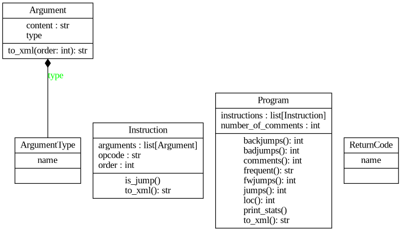

Documentation of First Project Implementation for IPP 2023/2024

Name and surname: Tomáš Brablec

Login: xbrabl04

## Overall design

Design of the parser is focused on simplicity, using composition over inheritance, and using Python's type system to check as much of the code statically as possible. Because of the simplicity of the IPKcode24 language, parsing is handled by decomposition using primitive string operations, as opposed to a more formal parsing method. Code is split into modules, one class per module in most cases. The class `Program` represents the entirety of source code and its construction handles all parsing. Classes `Instruction` and `Argument` represent single instructions and their arguments respectively, and their constructors handle the parsing of these source code units. Each class also implements its own XML serialization. `Program` also implements all necessary statistics to handle the `STATP` extension.

## Parsing

Parsing code leverages functional style patterns, mostly `map` and `filter` functions, to remove explicit loops from code.

In `Program`, the source code is split into lines, comments are counted and then stripped, and all empty lines are removed. After checking that the code has the correct header, lines are parsed into instructions.

The constructor of `Instruction` splits the line into opcode and arguments, which are then parsed separately. The list of all correct opcodes, along with the types of their arguments, are stored in a dictionary `INSTRUCTIONS`.

The enum `ArgumentType` is used to represent the type of instruction arguments. Its `__eq__` method is overloaded to allow for simple comparison of the `Symb` variant, representing any argument type, which is a valid symbol (either a variable, or a value).

## XML serialization

Serialization is again implemented in each class in the `to_xml` method. It is implemented manually using string interpolation, since the structure is simple, and it does not justify using an external library.

## Argument parsing and statistics

Arguments are parsed automatically using the `argparse` library. However, this library does not meet the requirements exactly parsing the required format of arguments, and it is only used here to check the syntax of arguments, and to generate a user-friendly usage and help message.

In the `print_stats` method on `Program`, all arguments are iterated through, and the required data is written to each output file. The statistics themselves are calculated in other methods on `Program`, which are decorated with `functools.cache`, which does automatic memoization, so that they are not recomputed again. This could also be done on the XML serialization, but it is not needed since it is only computed once.

## Error handling

As the assignment does not require any special error handling, all errors are handled by an immediate exit with an appropriate return code, and an error message. The enum `ReturnCode` and function `print_error_exit` are defined to simplify this process.

The code for nonessential functionality (`STATP` extension) is wrapped inside a `try` block, so that any exception in this part of program will not impact the essential functionality of the parser.

## Class diagram

