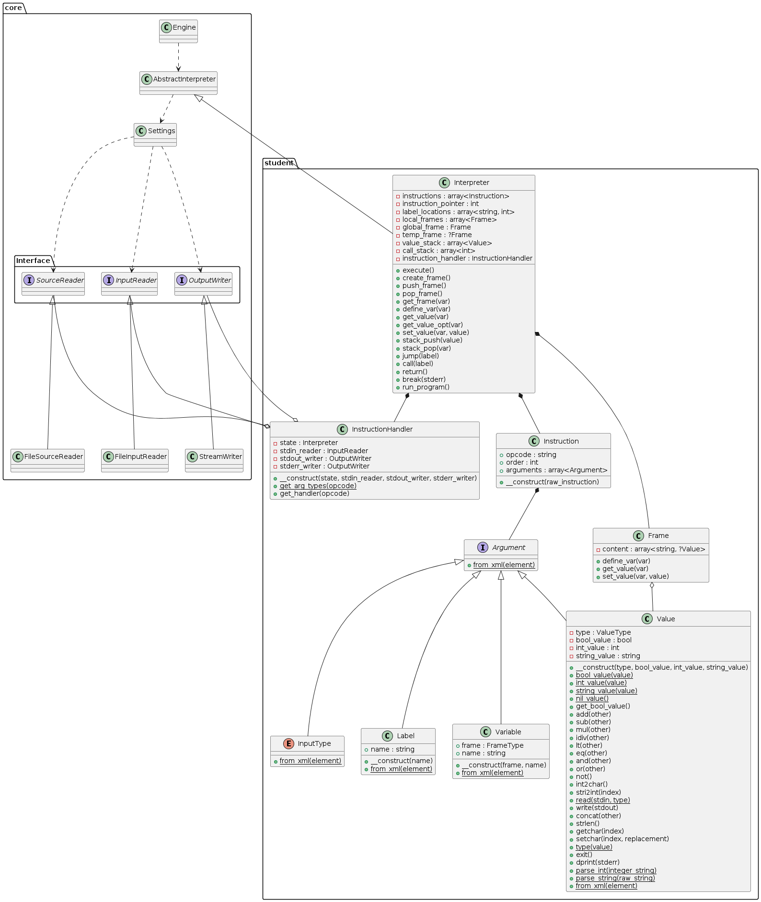

Documentation of Second Project Implementation for IPP 2023/2024

Name and surname: Tomáš Brablec

Login: xbrabl04

## Overall design

When creating the architecture of the interpreter, the main goal was to create such an infrastructure  that adding new instructions would be as simple as possible. Ideally, a new instruction should be a single-line change to the source code. This is almost true in the final code (see `InstructionHandler`).

## Classes

- `Interpreter` - This is the main class of the program, it inherits from `AbstractInterpreter`, which transparently handles argument parsing. `AbstractInterpreter` also provides the implementation of program input and output. These are exposed using the interfaces `InputReader` and `OutputWriter`, which are then passed into `InstructionHandler` (dependency injection). `AbstractInterpreter` also provides a parsed XML representation of the program code, which is validated using an XSD schema. This schema is stored as a constant string in `Interpreter.php`, and it validates that the element structure of the document conforms to the assignment. Element attributes are also validated, including their content (e.g., "positive integer" for `order`). This class also contains the interpreter entrypoint - the `execute` method. `execute` converts the input program into an internal representation (class `Instruction`), initializes internal structures (mainly memory frames, value stack, call stack, and instruction handler). Instructions are stored in an array; therefore, a simple integer (attribute `instruction_pointer`) can be used to specify the current instruction being executed. Then the `run_program` method is called. This method executes instructions in a loop by first getting the instruction's handler from `InstructionHandler`, and then calling the returned closure with the instruction's arguments. This method also does an extra step, which greatly simplifies the code of the instruction handlers themselves. Most instructions have parameters of type `Symb` - this means that either a literal value or a variable can be in place of this parameter. `run_program` converts all these arguments into values (literal values are passed as is, and variables are first loaded). This means that each closure returned from `InstructionHandler` can simply assume that an argument of type `Symb` is a literal value.

- `Frame` - This class implements a single memory frame. It is an associative array mapping a variable name to its value, its public interface consists of safe access functions that throw exceptions when accessing an undefined variable, or redefining a variable.

- `InstructionHandler` - The purpose of this class is to provide a closure for executing an instruction. The closure has parameters that correspond to the arguments of the instruction. This class is instantiated only once during initialization inside `Interpreter`. The instance gets access to `Interpreter`, 'InputReader', and `OutputWriter` for both outputs. These objects are then used inside the closures for executing instructions. This is designed according to the pattern of dependency injection. This makes it possible to, for example, have multiple instances of `Interpreter` inside a single program, or to redirect output to another file, simply by changing the `OutputWriter` that is passed into the constructor of `InstructionHandler`. This class also implements the static method `get_arg_types`, which returns an array of expected argument types for each instruction. This is used during instruction validation and execution, when checking argument types.

- `Instruction` - Class that represents a single instruction of the source program. The constructor validates the structure of XML, and runs constructors for all arguments. The exact names of XML tags are also validated (XSD schema can only validate that the elements `arg1`, 'arg2', and `arg3` are inside the instruction element, and that there is at most one of each). The types of arguments are also validated using the static method `InstructionHandler::get_arg_types`, the constructor gets the correct instruction types for each instruction, and then calls the appropriate argument's validation method (e.g., `Variable::from_xml`). This static method would throw an exception, if the passed XML element was not a variable.

- `Argument` - This is the common interface for all types that can occur as an argument of an instruction. It defines the static method `from_xml`, which constructs an instance from the corresponding XML element, while validating its content.

- `Value` - Class whose instances represent concrete values of IPPcode24 types (int, string, bool, nil). The public interface implements operations on these values. These operations never mutate the operands, they always return a new instance with the resulting value. All operations are type-checked, and an exception is thrown when incompatible types are used in a operation. Unfortunately, PHP does not have tagged unions, this feature is therefore emulated by having a separate tag (attribute `type` of enum type `ValueType`). The other attributes are not used in all instances, only the one attribute, that corresponds to the instance's type, is valid in that instance. For example, if the `type` attribute has the value `ValueType::Int`, then `int_value` holds the valid value of the instance, the other attributes (`bool_value`, `string_value`) are unused. Compared to the naive solution on simply declaring a single attribute of type `int|string|bool|null`, this has the added benefit of simpler type checking, and it simplifies the code of many methods. Most methods have to validate that the type of its arguments is compatible for that operation, using `match` on the `type` attribute is an elegant and safe way to do so (PHPStan can validate that the match is exhaustive, because `ValueType` is an enum).

- `InputType`, `Label`, `Variable` - These classes represent other possible types of instruction arguments. They do not implement any other functionality than instantiation from XML elements.

## Class diagram

Note that exception classes are omitted from the class diagram for clarity. These classes do not implement anything else except the constructor, which simply calls the parent constructor with a specific return code, and an error message.

