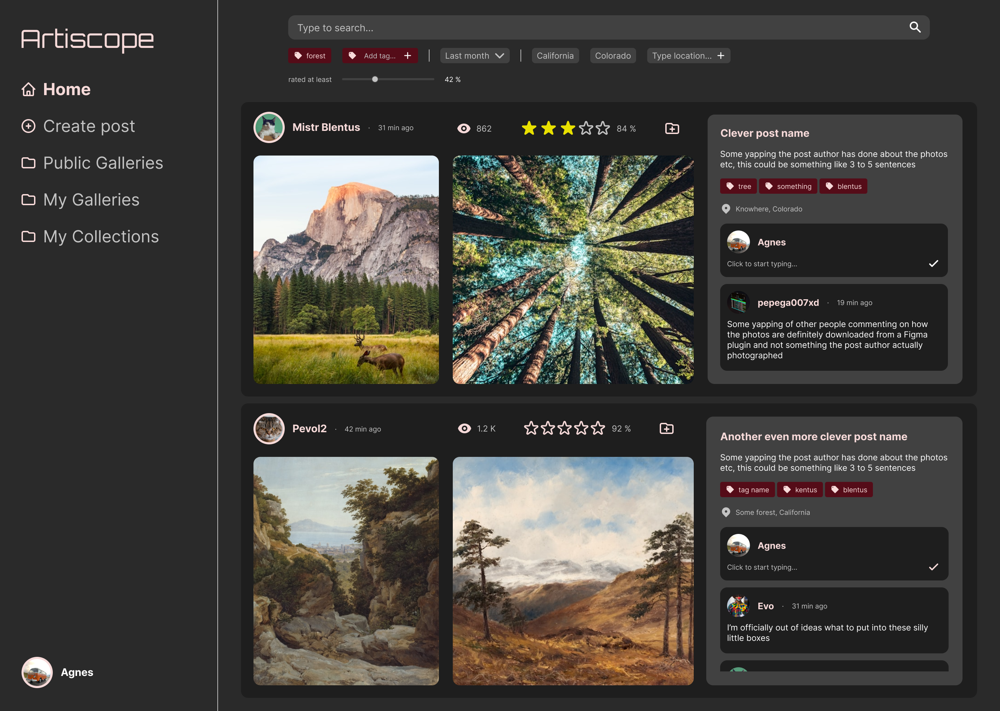
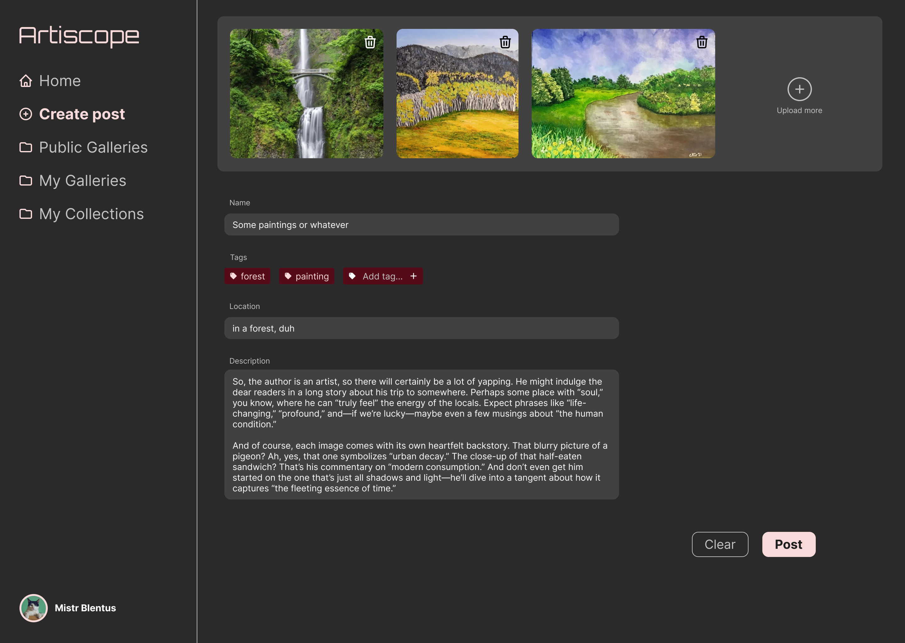
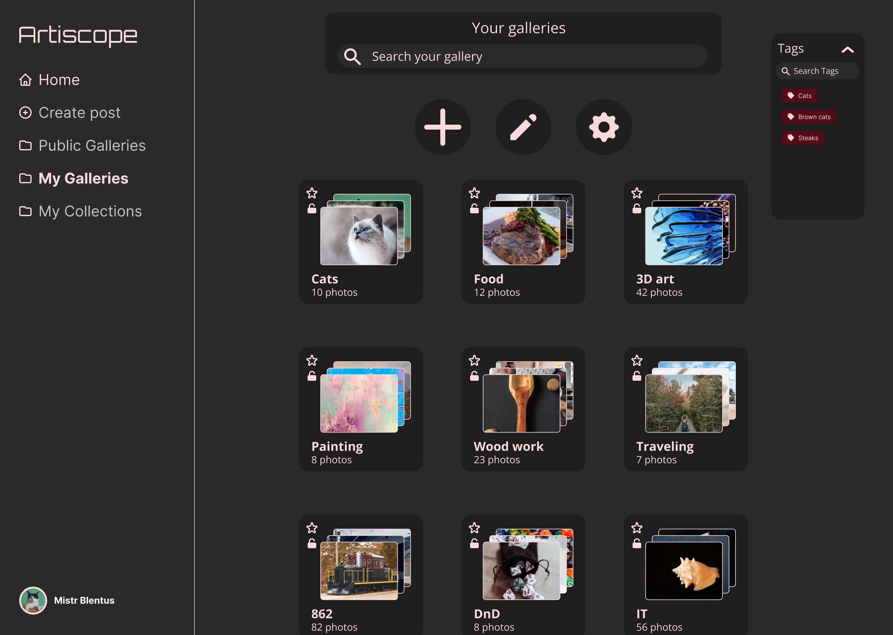
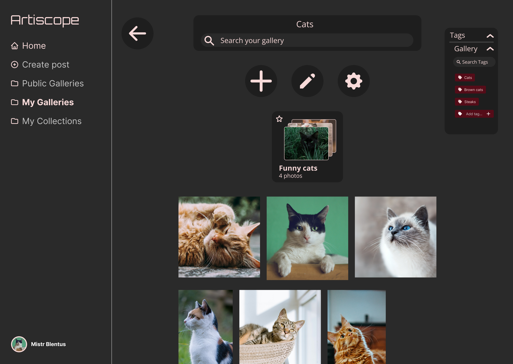
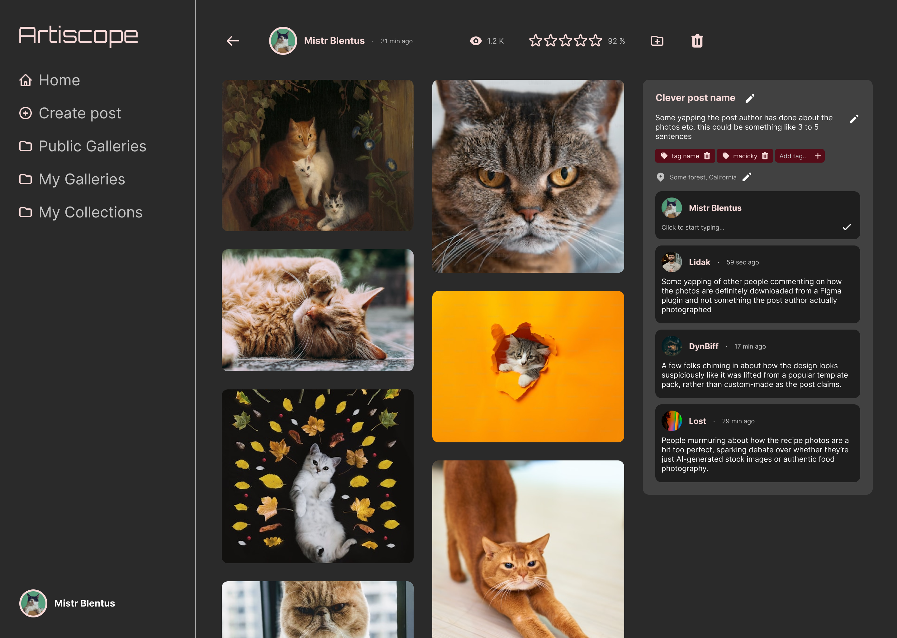

### Basic info

- App name: Artiscope
- Topic: Image sharing app with advanced organization features
- Tomáš Brablec (xbrabl04) - team leader
- Abas Hashmy (xhashm00)

# User study and specification

## Target users

The target user for the application is anyone who uses image sharing platforms such as Instagram or Pinterest for creative work, but requires more powerful tools for managing content than these platforms offer. This can include a wide range of creative professionals and hobbyists looking for inspiration, or users seeking licensable content.

A typical user of this application might be an artist looking for photos or digital art as an inspiration for their own creative project.

This user will need features to efficiently search through a large number of posts and to save them for later inspection. When the user decides to upload their own work, they will need to add metadata for better searchability of their own content by others. The user needs a way to save a large number of posts and to organize them. They also need a way to present their own work in an organized manner, in distinct portfolios for each of their creative projects. The user might want to comment on posts of others and to leave a rating.

### User survey (xbrabl04)

The interviewed user is a student with digital art as a hobby. He needs a platform for looking up reference photos and other users' art as inspiration. He currently uses Instagram for this purpose, but states that the platform isn't ideal for this.

When asked, what is the problem with his current solution, the user explained that Instagram doesn't allow users to search multiple tags at once, nor by text description. Also, he said that Instagram is aimed at casual users, not just artists, so there is a lot of unrelated content and low quality posts, and a lot of advertising inside posts, which makes it frustrating to browse through content to look for inspiration.

When asked, what are the missing features that he would like to see, the suggestions can be summed up to:
- The user would like to have a better rating system for posts
- There should be a better way to search posts (by names, tags, rating, ...)
- The user should have a better way to organize their posts (into groups, by project, ...)

I asked how the rating should look like, and the user recommended the system used by movie sites, where a user selects how many stars to give to a film. He would like to see a percentage rating on each post instead of just the number of likes.

I asked if he preferred the app on mobile or desktop, and the answer was that he would prefer to use the app on desktop, since it is more comfortable to look at pictures on a bigger screen, but he said that mobile app wouldn't be a major problem either.

### User survey (xhashm00)

The interviewed user is a soldier sometimes working in 3D and 2D design industry. Often when he works on projects he needs to store a large number of images that he uses as inspiration and for comparisons, for this he uses a standard filesystem in his operating system, because most modern applications have only standard bookmarks, which makes any organization impossible. This also prevents him from studying projects of other users effectively, because he has to search for each picture of the project manually instead of them being grouped together.

To fix this, he would like to have a filesystem in an image sharing application that would allow him to organize images directly in the application instead of having to download them and then manually transfer them troughout his device. This would also allow him and other users to share their projects for other people to see.

Without asking he expressed a desire to have features that would make navigating these galleries more convenient. Those features were:
- A search bar that allows users to find specific galleries and posts within them.
- Options to change how the galleries and posts are sorted (alphabetically or by size of the galleries)
- An option to change the gallery icon size to display either more or less galleries at a time.
- A way to assign specific tags to galleries and to use them for further filtering and to be able to search posts within them by tags as well.

Another desired feature was an option to make a specific gallery hidden to other users for either outdated or private projects.

When asked if he would prefer more complex or simpler implementation, he expressed a desire for an implementation that creates compact but organized collections and limits the user from creating very large and hard to navigate file structures.

## Requirement specification

The application should allow the user to:

- create posts containing multiple images, with name, description, and other metadata such as tags, location, and license type
- comment on and rate posts, rating as a 5-star selection, show total rating as percentage
- search posts using text (name, description), and filter the results by post metadata, rating and number of views
- sort posts by age, number of views or rating
- save posts and organize them into galleries, which have names and can have subgalleries, with search and filtering options
- organize user's own posts into collections, which have the same features as galleries
- open other users' collections and browse them
- modify name, description and other properties of an existing post

## Alternative apps

We looked at the following apps:

- Instagram (xbrabl04)
- Reddit (xbrabl04)
- Pinterest (xhashm00)
- DeviantArt (xhashm00)

### Instagram (xbrabl04)

Instagram is a platform for sharing media, designed primarily as a social network.

Pros:
- Instagram allows for a single post to contain multiple images, which can be browsed through as a slideshow, and allows users to specify the location of the post, which can then be shown on a map.
- It is possible to upload not just images, but also video and media containing links to external websites, which can be useful when presenting professional work.
- Instagram relies heavily on algorithmic recommendation of content based on previous viewing habits, which can direct users to content they might want to see, even when they don't know how to find it.

Cons:
- Instagram doesn't allow to attach much additional information to each post, the only thing a user can do is to add a textual description to their post, which is itself shown just as a "pinned" comment on the post itself.
- The search functionality on Instagram is very rudimentary. Instagram allows for searching users by their usernames, and allows to display posts which contain a provided tag. There is no way to search posts by their description or other properties.
- Instagram doesn't allow for meaningful rating of posts. The only rating is the number of positive likes ("hearts") shown under each post, but there is no way to give negative rating, and therefore there is no way to judge a post's quality based on rating. The number of views of each post is also not shown.

### Reddit (xbrabl04)

Reddit is a social network where users interact by posting content (text, media) in distinct groups (subreddits). Each subreddit typically has an assigned topic.

Pros:
- Each post on Reddit has a name, and it can optionally have a description containing rich-text elements - basic formatting, hypertext links, etc.
- Rating on Reddit is done through a positive or a negative reaction (up/downvote). Each post has a rating as a difference between the number of upvotes and downvotes, which gives the user an idea about the post's quality.
- It is possible to search posts by text (name, description), filter by age, and sort them by popularity, rating, or age.

Cons:
- Even though Reddit supports adding tags to posts, the set of tags is defined by each subreddit - user cannot add arbitrary tags to their posts.
- Even though a user can post to their own profile, it is not simple to view all their posts posted on their profile exclusively - all their posts in subreddits are displayed in a single list on their profile - it is hard to present user's work.
- There is no way to organize bookmarked posts - all saved posts are displayed in a single list with no way to organize them into galleries.

### Pinterest (xhashm00)

Pinterest is a website that allows users to share images and short videos that can be viewed by other users, who can then comment on them and save them to custom galleries.

Pros:
- Users have an easy access to a large amount of content thanks to a constant stream of images or videos.
- The ability to effectively store and categorize desired images and videos thanks to a custom gallery system.
- The ability to write comments on posts, engaging with the community and possibly correcting any mistakes in the post.

Cons:
- Finding posts for a specific topic can be troublesome, because there is no direct tag system, which causes the feed to start heavily diverging after a while of browsing.
- No feed of publicly shared galleries, allowing only an unorganized feed of singular posts.
- No way to create collections out of user's own posts, resulting in a disorganized view of a user's posts.

### DeviantArt (xhashm00)

DeviantArt is a website similar to Pinterest, but with a few key differences. Mainly, DeviantArt only allows image sharing and has a tag system that allows for more direct stream of images.

Pros:
- Tag system and short description of images, which allows for more accurate search results and better categorization of users own posts.
- Gallery system for user's own posts, this allows a user to coherently categorize their own work and other users to selectively view what they want from another user.
- Collection system for users to categorize their favorite posts from other users.

Cons:
- All of user's saved images are in all-posts gallery even when further categorized, resulting in a bloated main gallery for saved images.
- A single gallery or a collection has no further division options, this makes them inherently small in number of posts or bloated.
- Advanced options like private galleries are locked behind a paywall.

### Summary

The researched apps are all social media platforms focused on media sharing, but they vary significantly in content organization, customization, and search functionality. Some offer strong categorization and tagging systems for user content and saved items, while others lack advanced organization, making it challenging to maintain collections. The platforms also differ in engagement tools, with some allowing ratings or feedback mechanisms, while others only provide limited user interaction.

Key takeaways:

- When opened, the app should show the user a random feed of posts instead of just an empty search/filter window.
- There must be a way to effectively search, filter and sort posts, eg. by name, rating, age, etc.
- Users must be able to organize their own and other users' posts for better and more systematic experience.

# Project plan

The applications will have five main pages between which the user can switch.

> **Division of work**: Each of the following pages is assigned to a single team member, that is specified after the page name.

## Home page (xbrabl04)

The Home page will contain a search bar, filter settings, and a list of posts. By default, the page will show a list of latest posts without any filtering.

Each post will show the author's username and profile picture, post's name and description, a few images of the post, number of views and rating, and comments by other users. The post will also contain UI elements for adding a new comment, rating, and for storing the post into a gallery. Storing a post will involve a popup window for selecting the gallery or subgallery to store the post into. Each post can be viewed on a full page (described below).

## Create post page (xbrabl04)

This page will contain a list of images for the new post and text input for entering metadata. This is preferred over multipage design (where the user first selects images, then clicks "next" to enter the metadata), because the number of fields is not big, and it can be useful to see a preview of the images when entering the other information.

For entering the metadata, there will be textboxes for post name and description, and an empty box for adding a tag. When adding a tag, another empty tag should appear for entering more tags. The page will also serve as a draft - when the user closes the page and opens it later, the filled in data will still be present. There will also be a way to discard all data.

Upon creating a new post, the post should be displayed on a full page.

## Public galleries page (xhashm00)

This page contains all public galleries and collections created by all users, it provides all the search and filtering options as other gallery pages but it doesn't allow the user to edit anything on this page. The only use case where editing on this page is possible is when user finds and opens his own gallery among the public ones.

## User galleries page (xhashm00)

On this page, the user can create, view, edit, or delete his own galleries comprised of his own or other users' posts. User-owned galleries can be made private, preventing them from showing on the Public galleries page. Created galleries can also have subgalleries allowing further categorization. Subgalleries cannot be divided any further, this is to prevent users from creating large and difficult to navigate structures, but still providing a tool that allows effective categorization.

## User collections page (xhashm00)

On this page users can interact with their collections the same way as with galleries. A collection is a special type of gallery comprised of only user's own posts disallowing any posts from other users. The first collection is unique, it contains all of the user's posts even if they are added to other collections, this collection is private by default and cannot be deleted.

## Single post view (xbrabl04)

When opening a post either from galleries or from Home page, the post will be displayed on a full page, along with all its metadata (as described in Home page). If the current user is the author of the post, it will also be possible to edit the post's metadata (not the images themselves, instead of adding images to existing posts, the user will be encouraged to create a new post and use the Collections page for organizing their posts).

# GUI Mockup

## Home page



- scrollable list of posts
- text search, filters
- 5-star selection rating, scrollable comments, total rating as percentage

## Create post page



- post can contain multiple images
- name, description, tags, location

## Galleries



- view of user's galleries, which store posts and subgalleries
- search, filtering
- buttons for creating and modifying galleries and viewing settings



- view of a single gallery
- subgallery, and posts
- option to modify gallery tags and subgalleries
- option to remove posts from gallery

## Single post view



- modify post's name, description, tags and location
- option to delete the post
- "infinite scroll" view of images and comments

# Platform and technology

When selecting the target platform, we considered a native desktop/mobile application and a web application. We chose to make a web application for the following reasons:

- the users would prefer to use the app on the desktop
- a web application can be accessed from any desktop platform, unlike native apps written for the desktop platforms
- there is no need to access any client system functionality, for which we would need the application to run natively

When selecting a web framework, we wanted the following features:

- full-stack framework, which solves compiling, bundling, and running the whole application, including the backend
- the option to have the backend API as a set of regular functions which can be called from the frontend code, as opposed to manually using `fetch` to retrieve data from an API
- framework with a large existing userbase, so that it is compatible with most existing libraries/tools, and it is easy to find help when encountering issues during development

We selected the `Next.js` web framework. Next.js uses React for the frontend, and its own compiler to build and deploy a full web application using `Nodejs` as a runtime. We chose this particular framework because it is the most used full-stack framework currently in use and because it was recommended to us by more experienced web developers.

For the frontend, we use `Tailwind` to simplify styling, and `MaterialUI` to ensure a consistent visual style across the project, and to simplify the code by using existing components instead of creating our own.

For the backend, we chose `LowDB` as a simple wrapper over a JSON database stored in a file. This allows us to quickly change the data that our application uses, and to version this data using git.

# Backend API description

The following data structures are used to store the state of our application:

- a `User` structure with the username associated with the user

  ```ts
  export interface User {
    user_id: number,
    username: string,
  }
  ```

- a `Post` structure, containing all the images and metadata associated with a post, along with all comments and ratings of that post:

  ```ts
  export interface Post {
    post_id: number,
    authod_id: number,
    name: string,
    description: string,
    ratings: Rating[],
    views: number,
    tags: string[],
    location: string,
    photos: string[],
    comments: Comment[],
    creation_time: Date,
  }
  ```

- structures `Gallery` and `Subgallery`, which store references (using unique IDs) to posts contained within, along with their metadata:

  ```ts
  export interface Gallery {
    gallery_id: number,
    owner_id: number,
    is_public: boolean,
    name: string,
    posts: number[],
    subgalleries: Subgallery[],
  }
  ```

The database is then defined as:

```ts
export interface Database {
  posts: Post[],
  users: User[],
  galleries: Gallery[],
}
```

This database object is contained in a single file and it is not exported, the only way to interact with it is through Server Actions (exported API functions), which handle getting and setting various data. Next.js converts Server Actions to API endpoints automatically, therefore we don't have to declare any endpoint paths or do any serialization, we can just call the backend API functions from frontend code and these calls will be transformed to fetches with deserialization automatically by the Next.js compiler. Therefore, the backend is separated from the frontend even though there is no explicitly defined HTTP API.

Selection of key API functions:

```ts
// Called by the Create post form on submit,
// creates new post with from the data passed as input
function create_post(name: string, description: string,
  tags: string[], location: string, photos: string[])

// Called from the Home page, returns the posts to be displayed on the page.
// This will support filtering and sorting in the future
function get_posts(): Promise<Post[]>

// deletes post with the provided ID,
// called by the delete button from the Single post page
function delete_post(post_id: number)

// this and other functions change a single property on an existing post,
// called by the editing functions in Single post page
function change_post_name(post_id: number, name: string)

// these and other functions are called from the Public galleries,
// User galleries and Collections pages to view, create and modify data
function get_user_galleries(): Promise<Gallery[]>
function get_public_galleries(): Promise<Gallery[]>
function create_gallery(name: string, is_public: boolean)
function add_post_to_gallery(post_id: number, gallery_id: number)
function remove_post_from_gallery(post_id: number, gallery_id: number)
function change_gallery_name(gallery_id: number, name: string)

// functions for subgalleries closely mirror functions for galleries
function create_subgallery(gallery_id: number, name: string) {
...
```
